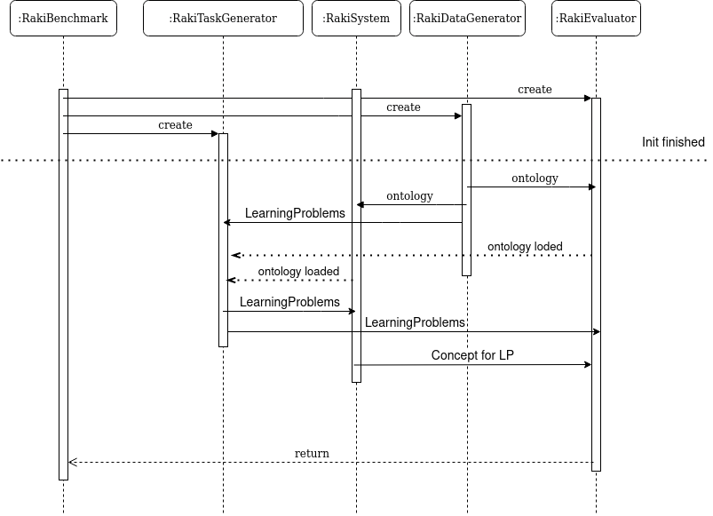

In this section we will explain the overview of Hobbit. 

## Usage

1. Go to https://git.project-hobbit.eu 
2. Login
3. Go to Benchmarks
4. Choose `Raki ILP Benchmark` or `Raki ILP Benchmark - Priv`
5. Choose the system you want to benchmark
6. set the parameters you want to use (see below)
7. choose the benchmark you want to execute (benchmark name)
8. Execute

## Parameters

The Hobbit frontend allows a few parameters to be used.

| Name | Description | Default |
| -----| --------------| -------|
| Benchmark name | The Benchmark Name to use | |
| Timeout in MS | The timeout to use in MS for each learning problem | 60000 (1min) |
| Ratio of positives to system should receive | Will randomly choose the specified percentage (0.0, 1.0) of positive uris.  | 1.0 |
| Minimum Examples if ratio is set < 1 | the minimum amount of positive examples that should remain of splitRatio is smaller than 1 | 5 |
| Seed | Seed to use for any random activity | 123 |

## Workflow 

The following image shows the time flow of the Raki Hobbit Modules

The RakiBenchmark and the RakiSystem will be created by the Hobbit System.

After that the RakiBenchmark creates the RakiTaskGenerator, the RakiDatagenerator and the RakiEvaluation.

The init phase of Hobbit ends and the RakiSystem and the RakiEvaluator needs the Ontology they should use.

The RakiDataGenerator will load the Ontology to be used and sends it to the RakiSystem and the RakiEvaluator.
To assure that it has fully send the Ontology, the RakiDataGenerator will then send a command to both modules, indicating it has fully send the ontology.

The RakiSystem and the RakiEvaluator will then load the ontology and each sends a command to 
the RakiTaskGenerator indicating they have loaded the Ontology and are readyto go.

In the same time, the RakiDataGenerator will send the RakiTaskGenerator the LearningProblems to the RakiTaskGenerator.
Each LearningProblem is one task and thus the DataGenerator will send each LearningProblem, and not all at once.
Be aware that the image simplifies this.

As soon as the RakiTaskGenerator got the Ontology loaded commands it will send the 
Learning problem to the system (without a gold standard concept) and the full learning problem to the RakiEvaluator.
Be aware that the image simplifies this by simply sending all learning problems instead of each one by one.

The RakiSystem will then send the concept it generated from the learning problem to the evaluation storage (which will then be send to the evaluator).

After the RakiTaskGeneratir and RakiSystem finished their tasks, the RakiBenchmark controller will send a command
to the RakiEvaluator to start the evaluation. (This is needed, as the RakiEvaluator sometimes ended prematurely)

As soon as the RakiEvaluator finished evaluation, it will send the Result model to the RakiBenchmark Controller.

